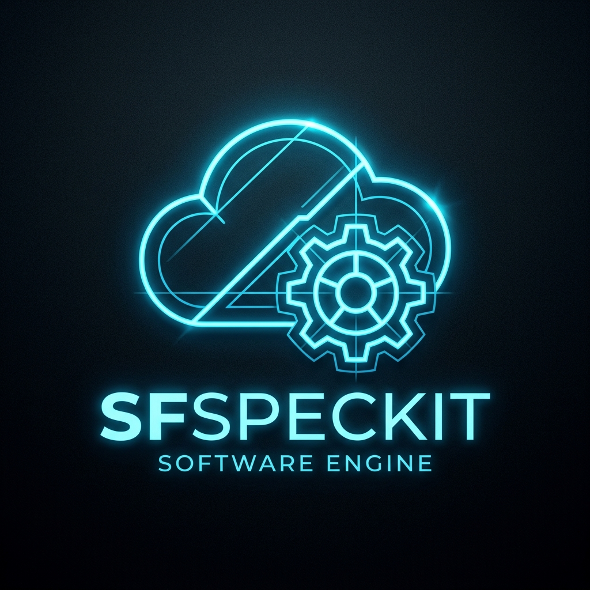
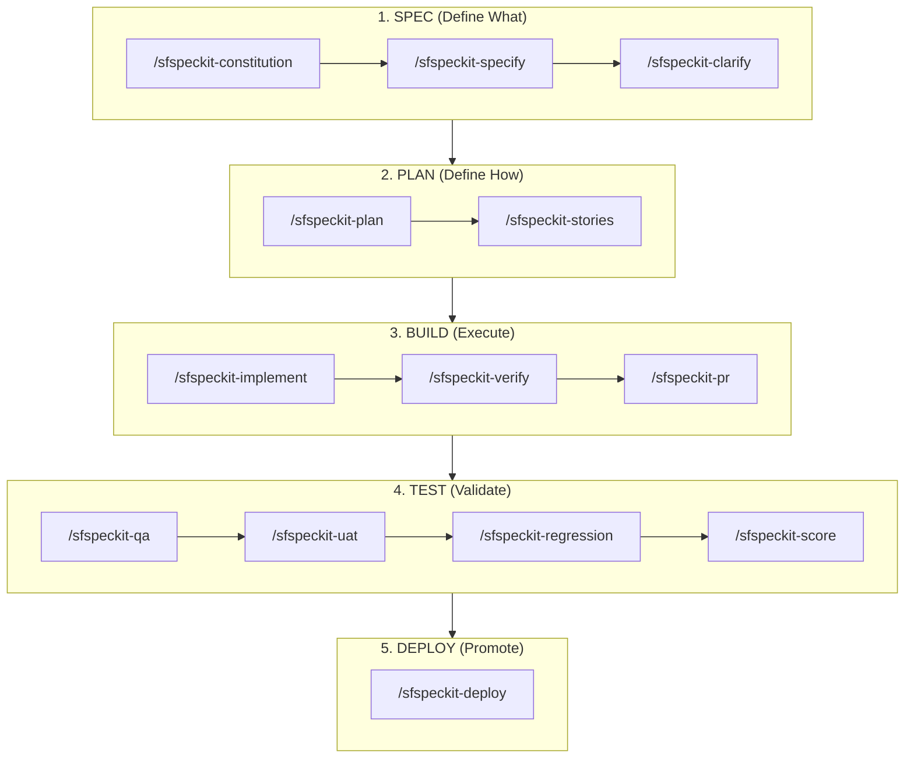

<div align="center">
  
  <h1>SFSpeckit</h1>
  <p><b>Enterprise-Grade Spec-Driven Development (SDD) Framework for Salesforce: AI-Powered, Human-in-the-Loop Engineering.</b></p>


</div>

<br/>

**Transforming Salesforce delivery into an evidence-based, autonomous engine driven by structured specifications.**

---

## 📖 Table of Contents

- [🏗️ Spec-Driven Development (SDD)](#️-spec-driven-development-sdd-for-ai)
- [🎯 What Is This?](#-what-is-this)
- [👨‍💻 Built by an Architect](#-built-by-an-architect)
- [🛠️ Prerequisites & Dependencies](#️-prerequisites--dependencies)
- [🚀 One-Command Install](#-one-command-install)
- [🤖 For AI Agents (Auto-Setup)](#-for-ai-agents-auto-setup)
- [💻 Cross-IDE Compatibility](#-cross-ide-compatibility)
- [📋 Slash Commands](#-slash-commands)
- [⚡ Execution Log](#-execution-log-the-first-5-minutes)
- [🛡️ The 9 Salesforce Constitution Articles](#️-the-9-salesforce-constitution-articles)
- [📁 Repository Structure](#-repository-structure)
- [⚖️ License & Governance](#️-license--governance)

---

## 🏗️ Spec-Driven Development (SDD) for AI

SFSpeckit is built on the philosophy of **Spec-Driven Development (SDD)**. In the era of AI-agentic coding, jumping directly into implementation is the fastest way to hit context limits, create hallucinations, and accumulate technical debt.

### The SDD Strategy:

`Requirements (Spec) >>> Design (Plan) >>> Implementation (Build) >>> Test >>> Deploy`

> [!IMPORTANT]
> **Human-in-the-Loop (HITL) Engineering**: SFSpeckit is a Spec-Driven Development framework that enforces human validation and verification at every milestone. This ensures that the AI remains a grounded co-pilot, eliminating hallucinations and context drift through rigorous human sign-offs.



1.  **SPEC (Define What)**: Functional requirements, user stories, and security matrices.
2.  **PLAN (Define How)**: Metadata strategy, class structures, deployment order, and impact analysis.
3.  **BUILD (Execute)**: Autonomous implementation with auto-heal loops and human verification.
4.  **TEST (Validate)**: Multi-persona QA, UAT sign-offs, and multi-org regression scoring.
5.  **DEPLOY (Promote)**: Evidence-based promotion across complex environment landscapes.

### Why SDD Framework for Salesforce?

- **🧠 Context Isolation**: By separating planning from building, the AI focuses on one logical layer at a time, drastically reducing hallucinations.
- **🛡️ Hallucination Guardrails**: Mandatory prerequisites and human-led scoring gates ensure the AI never proceeds on assumptions.
- **⚡ Zero Drift**: The Spectrum Engine CLI locks the complex logic, preventing the AI from "drifting" away from architectural best practices.
- **☁️ Salesforce-Native**: Built exclusively for Salesforce, leveraging the Metadata API and enterprise-grade design patterns (Selector, Domain, Service).

---

## 📊 SFSpeckit vs. Standard "Chat-and-Code"

| Feature                      | Standard "Chat-and-Code"        | SFSpeckit SDD Framework                |
| :--------------------------- | :------------------------------ | :------------------------------------- |
| **Success Rate**             | ~60% (Hallucination Risk)       | **>95% (Deterministic)**               |
| **Hallucination Protection** | None (Pure AI Autonomy)         | **HITL Verification & Gated Inputs**   |
| **Technical Debt**           | High (Inconsistent patterns)    | **Zero (Architect-enforced articles)** |
| **Logic Drift**              | High (Instructions change/fade) | **None (Locked Spectrum Engine CLI)**  |
| **Scalability**              | Fails at 2+ complex features    | **Enterprise-Grade Scalability**       |
| **Certification**            | None                            | **agentskills.io Compliance**          |

---

**🛡️ Evidence-Based Quality**: Every build is measured against the Spec and the Constitution, providing a deterministic audit trail before any code is merged.

- **🔄 Auto-Heal**: If a build fails, the AI refers back to the Plan to self-correct, rather than guessing the intended logic.

---

## 🎯 What Is This?

SFSpeckit is a methodology + toolkit that gives your Salesforce team:

- **17 Slash Commands**: A complete lifecycle from `/sfspeckit-specify` to `/sfspeckit-deploy`.
- **Autonomous Auto-Heal**: `/sfspeckit-implement` automatically fixes linting, logic, and test errors by orchestrating your team's specific Salesforce skills.
- **Evidence-Based Discovery**: `/sfspeckit-constitution` now automatically scans your org for managed packages, integration endpoints, and metadata maturity to establish project principles tailored to your environment.
- **CLI-Driven Drift Detection**: `/sfspeckit-clarify` identifies manual org changes and multi-team conflicts before a plan is finalized.
- **Verification Evidence**: `/sfspeckit-verify` generates formal, audit-ready evidence (Coverage, Security, Performance) required for PR approval.
- **Enterprise Multi-Org Support**: Orchestrates deployments across Dev, QA, UAT, and Production with built-in dependency resolution.

---

## 👨‍💻 Built by an Architect

SFSpeckit is inspired by GitHub's spec-kit. It has been re-architected from the ground up by **Sumanth Yanamala**, a Salesforce Architect, to meet the unique challenges of the Salesforce development lifecycle.

Find more about the creator and his work on his **[Personal Website](https://ysumanth06.github.io/LinkedIn-Personal-Website/)**.

The toolkit focuses on **metadata-driven development**, robust quality gates, and **autonomous Agentforce readiness**, ensuring that AI-assisted coding is as safe as it is fast.

---

## 🛠️ Prerequisites & Dependencies

Before using SFSpeckit, ensure your environment meets the following requirements:

- **Salesforce CLI (sf v2)**: Required for metadata operations. Install via: `npm install -g @salesforce/cli`.
- **Salesforce Code Analyzer (v5)**: Required for automated quality gates. Install via: `sf plugins install code-analyzer`.
- **GitHub CLI (gh)**: Required for PR automation via `/sfspeckit-pr`. Install via: `gh.github.com`.
- **Git**: Required for version control. Install via: `git-scm.com`.
- **AI Agent Runtime**: Antigravity, Cursor, or Claude Code.

---

## 🚀 One-Command Install

SFSpeckit includes automated installers that link the toolkit to your preferred AI Agent environment in seconds.

### macOS / Linux

```bash
cd SFSpeckit && chmod +x install.sh && ./install.sh --ide all
```

### Windows (PowerShell)

```powershell
cd SFSpeckit; .\install.ps1 -IDE all
```

> [!TIP]
> **Automated Dependency Setup**: The installers detect missing tools (`sf`, `gh`) and offer to install them via **npm**, **Homebrew**, or **Winget** automatically.

---

## 🛠️ The Spectrum Engine (Unified CLI)

The **Spectrum Engine** is the core orchestrator of the SFSpeckit framework. It abstracts complex Salesforce and Git operations into simple, deterministic commands that ensure architectural consistency and project traceability.

### Why use it?

- **Zero Configuration**: Agents call simple commands like `verify` instead of managing complex `sf` and `git` flags.
- **Deterministic Output**: Provides a unified `--json` interface for AI agents to process results without hallucinations.
- **Architectural Rigor**: Every operation is logged and verified against the Project Constitution.

### 🤖 Autonomous Execution

You **do not** need to run these commands manually. Your AI assistant (Antigravity, Cursor, etc.) automatically invokes the Spectrum Engine based on the instructions defined in the [Slash Commands](#-slash-commands) section.

> [!NOTE]
> While optimized for AI agents, the Spectrum Engine provides a **Premium Dashboard** experience if you choose to run commands manually for a quick health check.

---

## 🤖 For AI Agents (Auto-Setup)

If you are an AI assistant tasked with setting up this toolkit:

1.  **Clone** this repo to the project root.
2.  **Run** the installer in silent mode:
    - **Mac**: `./install.sh --ide all --yes`
    - **Windows**: `.\install.ps1 -IDE all -Yes`

---

## 💻 Cross-IDE Compatibility

SFSpeckit is **IDE-agnostic**. The core logic lives in structured Markdown "skills" that can be interpreted by any assistant.

| Tool            | How to Use                                   |
| --------------- | -------------------------------------------- |
| **Antigravity** | Natively compatible via `.agents/skills`.    |
| **Cursor**      | Copy/link skills into `.cursor/rules/`.      |
| **Claude Code** | Point Claude to the `SF-Spec-Kit` directory. |

---

## 📋 Slash Commands

| Command                    | Who  | Purpose                                                                 |
| -------------------------- | ---- | ----------------------------------------------------------------------- |
| `/sfspeckit-constitution`  | TPO  | **[DISCOVERY]** Establish principles with evidence-based org discovery. |
| `/sfspeckit-specify`       | TPO  | Create functional feature specs.                                        |
| `/sfspeckit-clarify`       | Arch | **[DRIFT ALERT]** Deep gap analysis and drift audit.                    |
| `/sfspeckit-plan`          | Arch | Technical blueprint and deployment order.                               |
| `/sfspeckit-stories`       | Arch | Break plan into Jira-ready developer stories.                           |
| `/sfspeckit-implement`     | Dev  | **[AUTO-HEAL]** Build story by orchestrating SF skills.                 |
| `/sfspeckit-verify`        | Dev  | Generate "Verification Evidence" (Coverage, Security, Perf).            |
| `/sfspeckit-pr`            | Dev  | Prepares PR summary via `gh cli`.                                       |
| `/sfspeckit-qa`            | QA   | Multi-persona UI validation.                                            |
| `/sfspeckit-uat`           | BPO  | Business UAT scripts and sign-offs.                                     |
| `/sfspeckit-regression`    | QA   | Full feature regression before release.                                 |
| `/sfspeckit-release-notes` | TPO  | Business-ready delivery summary.                                        |
| `/sfspeckit-score`         | QA   | Real-time project health dashboard.                                     |
| `/sfspeckit-change`        | TPO  | Impact analysis for mid-sprint changes.                                 |
| `/sfspeckit-hotfix`        | Dev  | Emergency production patch workflow.                                    |
| `/sfspeckit-deploy`        | Arch | Multi-org environment promotion.                                        |

---

## ⚡ Execution Log: The First 5 Minutes

Experience the autonomous discovery in action. SFSpeckit doesn't just ask questions; it scans your reality.

```text
$ /sfspeckit-constitution
> [!WARNING] Starting Environmental Discovery. Large orgs may take 1-2 minutes to scan.

[1/6] Scanning Installed Packages... DONE
      Detected: fflib Apex Common, Salesforce CPQ, Slack for Salesforce.
[2/6] Detecting Integration Endpoints... DONE
      Detected: 3 Named Credentials, 1 External Service (MuleSoft).
[3/6] Assessing Metadata Maturity... DONE
      Status: Active Flows (142) > Apex Classes (86).
      Posture: Flow-centric environment.
[4/6] Checking Org Limits... DONE
      AI Credits: 84% remaining.
[5/6] Syncing Constitution Articles... DONE
      Adjusting Article III: Strengthening Flow-first mandate based on org maturity.
      Adding Article X: Managed Package Coexistence (CPQ conflict prevention).
[6/6] Generating Document: .sfspeckit/memory/constitution.md... DONE

Constitution established. Ready for /sfspeckit-specify.
```

---

## 🛡️ The 9 Salesforce Constitution Articles

| Article | Principle         | What It Enforces                              |
| ------- | ----------------- | --------------------------------------------- |
| I       | Metadata-First    | Objects/Fields before logic.                  |
| II      | Bulk Awareness    | Mandatory 201+ record handling.               |
| III     | Declarative-First | Flow over Apex decision mandate.              |
| IV      | Absolute Security | `with sharing` & `WITH USER_MODE`.            |
| V       | PNB Test Pattern  | Positive, Negative, Bulk test scenarios.      |
| VI      | Clean Layers      | Logic separation (Service, Selector, Domain). |
| VII     | Deployment Safety | Mandatory dry-runs and syncs.                 |
| VIII    | Platform Context  | Prompt-ready architectural clarity.           |
| IX      | Modular Logic     | Reusable, testable domain units.              |

---

## 📁 Repository Structure

```
SFSpeckit/
├── .cursor/
│   └── skills/                             # AI Skills (Cursor Optimized)
│       ├── sfspeckit-implement/
│       └── ...
├── .agents/                                # AI Skills (Agentic Optimized)
│   └── skills/                             # Linked via Installer
├── sfspeckit/                              # Project Memory & Docs
│   ├── memory/
│   │   └── constitution.md                 # Project "North Star"
│   └── specs/                              # Feature Specifications
│       └── 001-feature-name/
│           ├── spec.md                     # Functional Spec
│           ├── plan.md                     # Technical Plan
│           ├── verification-evidence.md    # Automated Evidence
│           └── stories/                    # Developer Work Units
└── force-app/                              # Salesforce Metadata
```

---

## ⚖️ License & Governance

This project is licensed under the **MIT License**. See the [LICENSE](LICENSE) file for the full text.

- **Security**: Please refer to [SECURITY.md](SECURITY.md) for vulnerability reporting.
- **History**: See [CHANGELOG.md](CHANGELOG.md) for version evolution and updates.

---

## 🌟 Giving Back

This framework is my contribution to the incredible Salesforce community. Throughout my career, the community has been a constant source of support, learning, and inspiration. I am sharing **SFSpeckit** with deep love and gratitude as a way to give back to the platform and the people that have shaped my professional journey.

---

## ❤️ Special Thanks

This project is the result of many months of work, often stretching into late nights after office hours and weekends. I want to extend my deepest gratitude to my wife, **Srija**, for her unwavering support, understanding, and patience throughout this journey. This project wouldn't have been possible without her.
